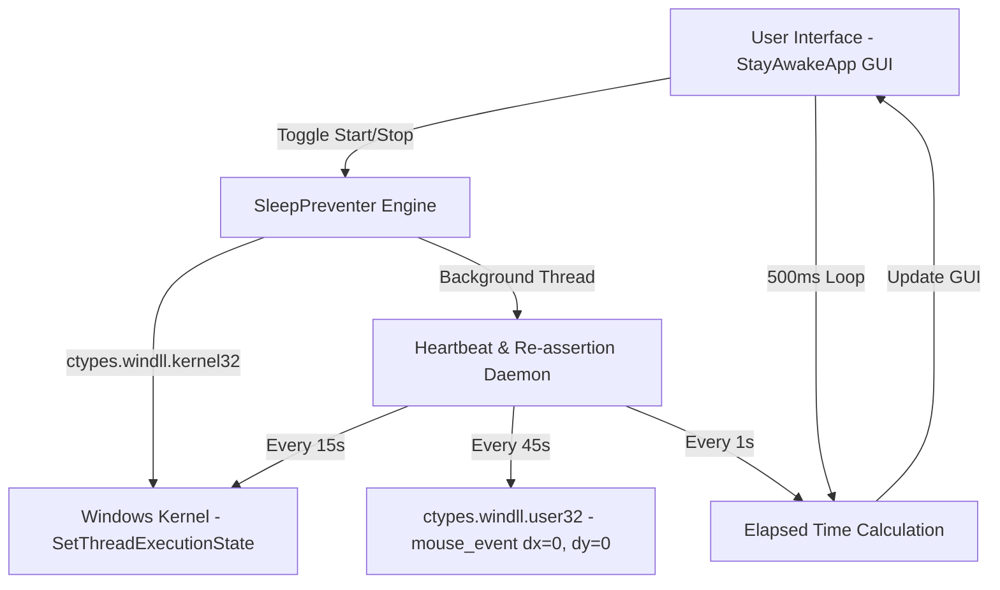

# 🏗️ Architecture & Technical Documentation - Uyanık Kal / Stay Awake

**Creator / Geliştirici**: Hasan Aras DEMİR  
**Copyright © 2026 Hasan Aras DEMİR. Tüm Hakları Saklıdır. / All Rights Reserved.**

This document provides a comprehensive technical overview of the internal architecture, Windows Power API integration, continuous re-assertion daemon, threading model, and GUI loop.

---

## 📐 System Architecture Diagram



---

## 🔬 Core Components

### 1. Windows Power State Manager (`SleepPreventer`)

The core execution engine uses native Windows kernel calls to modify the execution thread state.

#### Windows API Constants (`kernel32.dll`)

```python
ES_CONTINUOUS       = 0x80000000  # Informs system that state remains in effect until called again
ES_SYSTEM_REQUIRED  = 0x00000001  # Forces system to stay awake (prevents PC sleep)
ES_DISPLAY_REQUIRED = 0x00000002  # Forces display to stay powered on (prevents screen turn off)
ES_AWAYMODE_REQUIRED= 0x00000040  # Away mode execution
```

#### State Transitions

- **Active State**:
  ```python
  flags = ES_CONTINUOUS | ES_SYSTEM_REQUIRED | ES_DISPLAY_REQUIRED
  ctypes.windll.kernel32.SetThreadExecutionState(flags)
  ```
  This registers the current thread with the Windows Power Manager. Windows will ignore idle timers for screen turn-off, system sleep, and automatic lock screens.

- **Continuous Re-assertion Daemon**:
  To guarantee 100% sleep prevention reliability against corporate power policies or GPO resets, the background daemon thread periodically re-asserts `SetThreadExecutionState(flags)` every 15 seconds.

- **Dormant State (Reset)**:
  ```python
  ctypes.windll.kernel32.SetThreadExecutionState(ES_CONTINUOUS)
  ```
  Restores standard Windows Power Plan timers (e.g. sleep after 15 minutes of inactivity).

---

### 2. Background Heartbeat Thread

To complement `SetThreadExecutionState` and guarantee immunity against aggressive third-party IT policies or sleep override software, a background daemon thread executes a zero-displacement mouse signal:

```python
MOUSEEVENTF_MOVE = 0x0001
ctypes.windll.user32.mouse_event(MOUSEEVENTF_MOVE, 0, 0, 0, 0)
```

- **Displacement**: `dx = 0, dy = 0`.
- **Interval**: 45 seconds.
- **User Impact**: Zero. The mouse cursor does not move, text selection is not interrupted, and click focus remains untouched.

---

### 3. Graphical User Interface (`StayAwakeApp`)

Built on top of Python's standard `tkinter` library paired with `Pillow (PIL)` for high-DPI asset rendering.

- **Theme Palette**:
  - Background: `#0B0F19` (Dark Slate)
  - Card Containers: `#111827` (Deep Navy)
  - Borders: `#1F2937`
  - Active State (Accent): `#10B981` (Emerald Green)
  - Inactive State: `#EF4444` (Crimson)
  - Glow Accent: `#06B6D4` (Neon Cyan)
- **Non-Blocking GUI Loop**:
  The GUI uses `after(500, self._update_timer_loop)` for updating the time elapsed display without blocking the main event loop or causing UI lag.

---

## ⚡ Performance & Resource Specs

- **CPU Usage**: `< 0.1%` (Negligible)
- **RAM Footprint**: `~18 MB - 25 MB`
- **Network Bandwidth**: `0 KB/s` (Zero network traffic)
- **Disk I/O**: `0 KB/s` after initial launch
