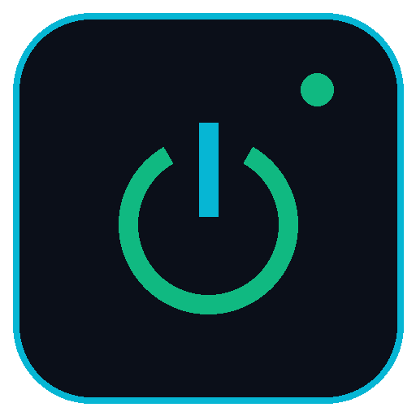
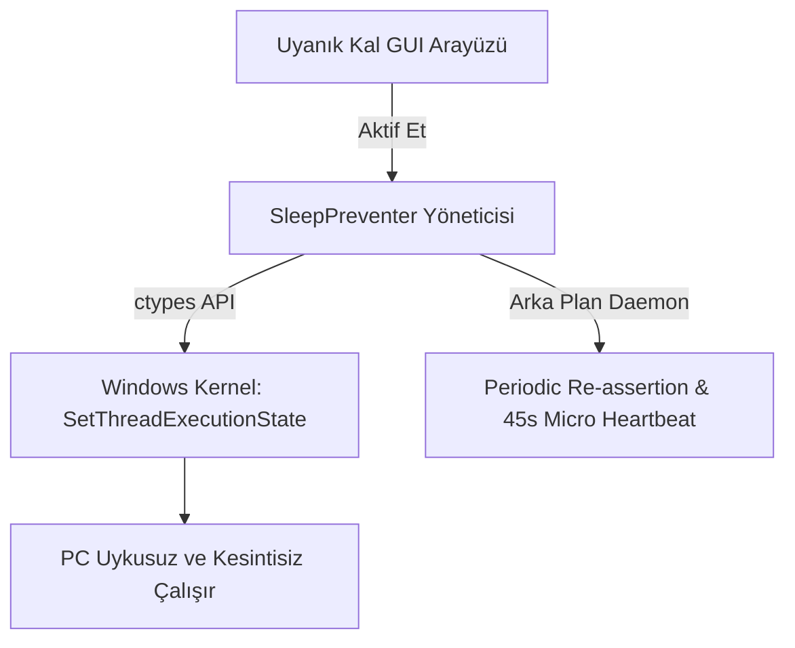

# 🛡️ Uyanık Kal / Stay Awake - Windows Uyku ve Ekran Kapanma Önleyici (Python 3.12)

<p align="center">
  
  <br>
  <b>Kişi aktif ederse bilgisayarınız siz kapatana kadar (ister 100.000.000.000 dakika bakmayın) ASLA kapanmaz veya uykuya girmez!</b>
  <br>
  <sub><b>Creator / Geliştirici: Hasan Aras DEMİR</b> • Copyright © 2026 Hasan Aras DEMİR. All Rights Reserved.</sub>
</p>

<p align="center">
  <a href="SECURITY.md"></a>
  <a href="LICENSE"></a>
  <a href="ARCHITECTURE.md"></a>
  
  
</p>

---

## 📚 Dokümantasyon İndeksi (Documentation Index)

- 🛡️ **[SECURITY.md](SECURITY.md)**: Güvenlik politikası, sıfır-ağ bağımlılığı ve bildirim kılavuzu.
- 🏗️ **[ARCHITECTURE.md](ARCHITECTURE.md)**: Win32 Power API, `SleepPreventer` mimarisi ve thread yapısı.
- ❓ **[FAQ.md](FAQ.md)**: Sıkça sorulan sorular ve sorun giderme (Troubleshooting) kılavuzu.
- 🤝 **[CONTRIBUTING.md](CONTRIBUTING.md)**: Katkıda bulunma ve geliştirici rehberi.
- 📜 **[CHANGELOG.md](CHANGELOG.md)**: Sürüm geçmişi (v1.1.0).
- ⚖️ **[LICENSE](LICENSE)**: MIT Lisans şartları ve telif hakkı bildirimi (Hasan Aras DEMİR).
- 🤝 **[CODE_OF_CONDUCT.md](CODE_OF_CONDUCT.md)**: Topluluk davranışı kuralları.

---

## 📌 Proje Hakkında (About The Project)

**Uyanık Kal / Stay Awake**, uzun süreli indirmeler, render alma süreçleri, sunucu testleri veya bilgisayar başında olunmayan uzun saatlerde sistemin uyku moduna girmesini, ekranın kararmasını veya Windows'un kilitlenmesini engelleyen açık kaynaklı, modern bir Python 3.12 uygulamasıdır.

**Creator / Geliştirici**: Hasan Aras DEMİR



### 🌟 Öne Çıkan Özellikler

- ⚡ **Windows Native Power API**: Farenizi hareket ettirip ekrandaki çalışmanızı bozmak yerine, işletim sistemine doğrudan Windows Kernel (`SetThreadExecutionState`) düzeyinde "Uyanık Kal" sinyali gönderir.
- 🔄 **Kesintisiz Periyodik Yenileme**: Arka plan thread'i her 15 saniyede bir güç durumunu tekrar onaylayarak %100 uyanık kalma garantisi sunar.
- ⏱️ **Canlı Süre Sayacı**: Uygulama aktif olduğu sürece bilgisayarın kaç saattir/dakikadır kesintisiz uyanık tutulduğunu canlı gösterir (`00:00:00`).
- 🔘 **Tek Tıkla Aç/Kapat (Toggle)**: Yeşil butonla korumayı başlatabilir, dilediğiniz zaman kırmızı butonla tek tıkta durdurabilirsiniz.
- 🎨 **Modern Cyber Dark Tema & İkon**: Yüksek çözünürlüklü özel ikon tasarımı, canlı durum rozeti ve karanlık arayüz stili.
- ⚙️ **Esnek Koruma Ayarları**:
  - `Ekranın Kapanmasını Engelle`
  - `Sistemin Uykuna Girmesini Engelle`
  - `Arka Plan Fare Heartbeat Sinyali (Odağı bozmayan mikro sinyal)`

---

## 🚀 Hızlı Başlangıç (Quick Start)

### Yöntem 1: Çift Tıklayarak Çalıştırma (Önerilen)

1. Depoyu klonlayın veya ZIP olarak indirin:
   ```bash
   git clone https://github.com/HajxDeveloper-sys/stayawake-for-pc.git
   cd stayawake-for-pc
   ```
2. **Kurulum**: Bağımlılıkları ve sanal ortamı (`venv`) kurmak için `install.bat` veya `install.ps1` dosyasına çift tıklayın.
3. **Çalıştırma**: Uygulamayı başlatmak için `run.bat` veya `run.ps1` dosyasına çift tıklayın!

---

### Yöntem 2: Manuel Kurulum (Komut Satırı)

```bash
# Sanal ortam oluşturun
python -m venv venv

# Sanal ortamı aktif edin (Windows Command Prompt)
venv\Scripts\activate

# Gerekli kütüphaneleri yükleyin
pip install -r requirements.txt

# Uygulamayı başlatın
python main.py
```

---

## 📁 Proje Dizin Yapısı (Directory Structure)

```text
stayawake-for-pc/
├── .github/
│   ├── ISSUE_TEMPLATE/
│   │   ├── bug_report.md       # Hata bildirim şablonu
│   │   └── feature_request.md  # Özellik istek şablonu
│   ├── workflows/
│   │   ├── codeql.yml          # CodeQL SAST taraması
│   │   └── security-scan.yml   # Bandit & Pip-Audit taraması
│   ├── dependabot.yml          # Otomatik bağımlılık güncelleyicisi
│   └── PULL_REQUEST_TEMPLATE.md
├── assets/
│   ├── icon.ico                # Windows uygulama ikonu
│   └── icon.png                # PNG formatlı ikon
├── .gitignore                  # Güçlendirilmiş Git ignore politikası
├── ARCHITECTURE.md             # Teknik mimari ve Win32 API dokümantasyonu
├── CHANGELOG.md                # Sürüm değişiklik geçmişi (v1.1.0)
├── CODE_OF_CONDUCT.md          # Katkı topluluk kuralları
├── CONTRIBUTING.md             # Katkıda bulunma kılavuzu
├── FAQ.md                      # Sıkça sorulan sorular & Sorun giderme
├── install.bat                 # Otomatik kurucu (Batch)
├── install.ps1                 # Otomatik kurucu (PowerShell)
├── LICENSE                     # MIT Lisans belgesi (Hasan Aras DEMİR)
├── main.py                     # Ana Python uygulama kodu
├── README.md                   # Ana proje dokümantasyonu
├── requirements.txt            # Python çalışma bağımlılıkları (Pillow)
├── requirements-dev.txt        # Geliştirme & güvenlik test bağımlılıkları
├── run.bat                     # Tek tıkla başlatıcı (Batch)
├── run.ps1                     # Tek tıkla başlatıcı (PowerShell)
├── SECURITY.md                 # Güvenlik ve gizlilik politikası
├── SECURITY_ARCHITECTURE.md    # 7 Katmanlı siber güvenlik dokümanı
├── security.py                 # Siber güvenlik & Anti-DDoS motoru
└── test_security.py            # Güvenlik test paketi
```

---

## 🔒 Güvenlik & Gizlilik (Security & Privacy)

**Uyanık Kal / Stay Awake** %100 yerel (offline) çalışır. Hiçbir telemetry, veri toplama veya internet erişimi yapmaz. Detaylar için **[SECURITY.md](SECURITY.md)** ve **[SECURITY_ARCHITECTURE.md](SECURITY_ARCHITECTURE.md)** dosyalarını inceleyebilirsiniz.

---

## 📜 Lisans & Telif Hakkı (License & Copyright)

Bu proje [MIT Lisansı](LICENSE) altında lisanslanmıştır.  
**Copyright © 2026 Hasan Aras DEMİR. Tüm Hakları Hasan Aras DEMİR Tarafından Korunmaktadır.**
