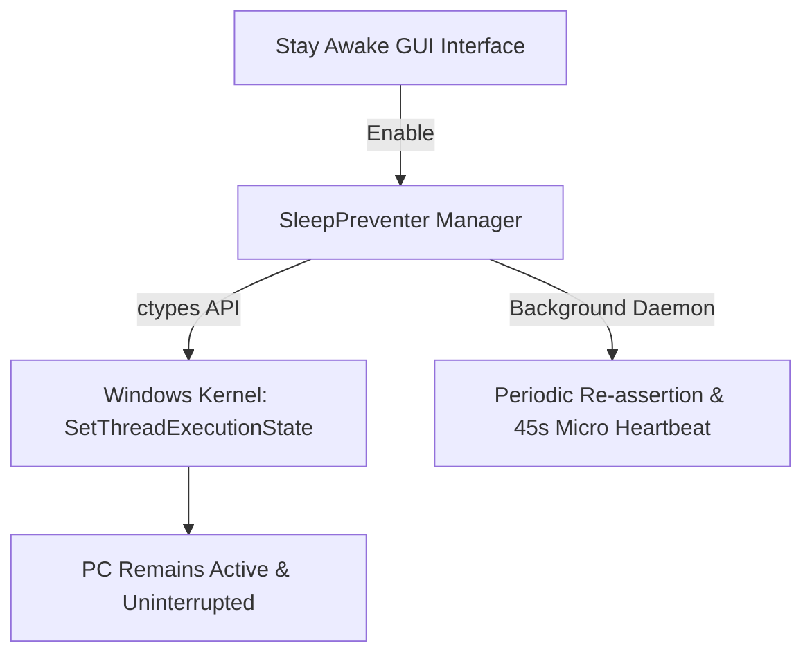

# 🛡️ Stay Awake - Windows Sleep and Screen Timeout Preventer (Python 3.12)

<p align="center">
  
  <br>
  <b>Keep Windows awake during long tasks, with clear status, timed sessions, and local-only preferences.</b>
  <br>
  <sub><b>Creator / Developer: Hasan Aras DEMİR</b> • Copyright © 2026 Hasan Aras DEMİR. All Rights Reserved.</sub>
</p>

<p align="center">
  <a href="SECURITY.md"></a>
  <a href="LICENSE"></a>
  <a href="ARCHITECTURE.md"></a>
  
  
</p>

---

## 📚 Documentation Index

- 🐍 **[PYTHON_INSTALLATION](PYTHON_INSTALLATION.md)**: Guide to Python installation and PATH configuration.
- 🛡️ **[SECURITY.md](SECURITY.md)**: Security policy, zero-network dependency, and vulnerability disclosure guide.
- 🏗️ **[ARCHITECTURE.md](ARCHITECTURE.md)**: Win32 Power API integration, `SleepPreventer` architecture, and threading model.
- ❓ **[FAQ.md](FAQ.md)**: Frequently asked questions and troubleshooting guide.
- 🤝 **[CONTRIBUTING.md](CONTRIBUTING.md)**: Guidelines for contributing and developer workflow.
- 📜 **[CHANGELOG.md](CHANGELOG.md)**: Version history and release notes (v1.2.0).
- ⚖️ **[LICENSE](LICENSE)**: MIT License terms and copyright notice (Hasan Aras DEMİR).
- 🤝 **[CODE_OF_CONDUCT.md](CODE_OF_CONDUCT.md)**: Community standards and code of conduct.

---

## 📌 About The Project

**Stay Awake** is an open-source Python 3.12 application designed to prevent Windows idle sleep and display timeout during long downloads, rendering tasks, server tests, or other extended work.

> **Important:** Stay Awake uses Windows' `SetThreadExecutionState` API. It does not override a manual lock, administrator policy, critical-battery action, or laptop-lid setting.

**Creator / Developer**: Hasan Aras DEMİR



### 🌟 Key Features

- ⚡ **Windows Native Power API**: Communicates directly with the Windows Kernel (`SetThreadExecutionState`) to maintain active power states without moving the visible mouse cursor or interrupting user workflow.
- 🔄 **Periodic Power Refresh**: A background thread continuously re-asserts the power state every 15 seconds to ensure system stability.
- ⏱️ **Live Uptime Counter**: Displays a real-time counter (`00:00:00`) tracking how long the system has been kept active continuously.
- 🕒 **Timed Sessions**: Choose Continuous, 30-minute, 1-hour, 2-hour, or custom sessions. The app shows the end time and automatically restores normal Windows power behavior when a timed session completes.
- 🔘 **One-Click Control**: Easily start or stop protection at any time via simple toggle controls.
- ✅ **Trustworthy Status**: The status card names exactly what is protected and reports a failed Windows power request instead of presenting a false “active” state.
- 🎨 **Modern Cyber Dark UI**: Clean dark interface featuring custom high-resolution icons and live status indicators.
- 💾 **Remembered Preferences**: Language, selected protection options, session duration, and window size are saved locally under the current user's AppData folder. Protection is never auto-resumed after a restart.
- ⚙️ **Configurable Protection Settings**:
  - `Prevent Display Sleep`
  - `Prevent System Sleep`
  - `Background Mouse Heartbeat Signal (Focus-friendly micro signal)`

---

## 🚀 Quick Start

### Method 1: Automated Script Execution (Recommended)

1. Clone the repository or download as ZIP:
   ```bash
   git clone https://github.com/HajxDeveloper-sys/stayawake-for-windows.git
   cd stayawake-for-windows
   ```
2. **Installation**: Run `install.bat` or `install.ps1` to automatically install dependencies and configure the virtual environment (`venv`).
3. **Run**: Run `run.bat` or `run.ps1` to launch the application.

---

### Method 2: Manual Installation (Command Line)

```bash
# Create a virtual environment
python -m venv venv

# Activate the virtual environment (Windows Command Prompt)
venv\Scripts\activate

# Install required dependencies
pip install -r requirements.txt

# Launch the application
python main.py
```

---

## 📁 Directory Structure

```text
stayawake-for-windows/
├── .github/
│   ├── ISSUE_TEMPLATE/
│   │   ├── bug_report.md       # Bug report template
│   │   └── feature_request.md  # Feature request template
│   ├── workflows/
│   │   ├── codeql.yml          # CodeQL SAST scan workflow
│   │   └── security-scan.yml   # Bandit & Pip-Audit security scan workflow
│   ├── dependabot.yml          # Automated dependency updater configuration
│   └── PULL_REQUEST_TEMPLATE.md
├── assets/
│   ├── icon.ico                # Windows application icon
│   └── icon.png                # PNG format application icon
├── .gitignore                  # Hardened Git ignore policy
├── ARCHITECTURE.md             # Technical architecture & Win32 API documentation
├── CHANGELOG.md                # Version release history (v1.2.0)
├── CODE_OF_CONDUCT.md          # Community code of conduct guidelines
├── CONTRIBUTING.md             # Developer contribution guide
├── FAQ.md                      # Frequently asked questions & troubleshooting guide
├── install.bat                 # Automatic installation script (Batch)
├── install.ps1                 # Automatic installation script (PowerShell)
├── LICENSE                     # MIT License agreement (Hasan Aras DEMİR)
├── main.py                     # Ana Python uygulama kodu
├── PYTHON_INSTALLATION.md      # Python kurulum rehberi (TR/EN)
├── README.md                   # Ana proje dokümantasyonu
├── requirements.txt            # Python runtime dependencies (Pillow)
├── requirements-dev.txt        # Development & security testing dependencies
├── run.bat                     # Application launcher script (Batch)
├── run.ps1                     # Application launcher script (PowerShell)
├── SECURITY.md                 # Security & privacy policy
├── SECURITY_ARCHITECTURE.md    # 7-Layer cybersecurity architecture document
├── security.py                 # Security & Anti-DDoS engine
└── test_security.py            # Security test suite
```

---

## 🔒 Security & Privacy

**Stay Awake** operates 100% locally and offline. It contains no telemetry, data collection, or external network requests. For detailed security specifications, please see **[SECURITY.md](SECURITY.md)** and **[SECURITY_ARCHITECTURE.md](SECURITY_ARCHITECTURE.md)**.

---

## 📜 License & Copyright

This project is licensed under the [MIT License](LICENSE).  
**Copyright © 2026 Hasan Aras DEMİR. All Rights Reserved.**
