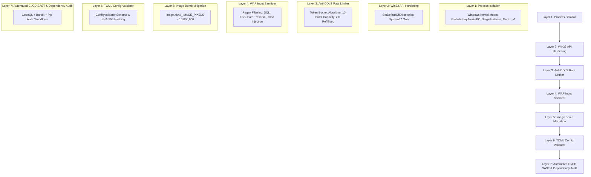

# 🛡️ Technical Security Architecture & Defense-in-Depth - Uyanık Kal / Stay Awake

**Creator / Geliştirici**: Hasan Aras DEMİR  
**Copyright © 2026 Hasan Aras DEMİR. Tüm Hakları Saklıdır. / All Rights Reserved.**

This document details the internal security architecture, threat mitigations, Anti-DDoS algorithms, and system hardening implemented in **Uyanık Kal / Stay Awake**.

---

## 🏛️ 7-Layer Defense-in-Depth Architecture

---

## 1. Anti-DDoS & Event Flooding Engine (`AntiDDoSController`)

### Mathematical Model (Token Bucket Algorithm)

The rate-limiting engine uses a token bucket algorithm to bound event frequencies:

$$Tokens_{new} = \min(Capacity, Tokens_{current} + \Delta t \times RefillRate)$$

- **Capacity ($C$)**: 10 burst tokens (configurable in `config.toml`).
- **Refill Rate ($r$)**: 2.0 tokens / second.
- **Cost per Action**: 1.0 token.

If an attacker attempts to click UI toggles or fire synthetic events at $N > 100$ actions/sec, all events exceeding the refill rate are safely ignored, preventing thread exhaustion or main loop blocking.

---

## 2. Process Flooding & Local DoS Protection (`SingleInstanceGuard`)

- **Mechanism**: Win32 Named Mutex via `ctypes.windll.kernel32.CreateMutexW`.
- **Mutex Handle**: `Global\StayAwakePC_SingleInstance_Mutex_v1`.
- **Behavior**: If `GetLastError()` returns `ERROR_ALREADY_EXISTS (183)`, Uyanık Kal / Stay Awake displays a security warning and terminates cleanly before allocating GUI resources or starting threads.

---

## 3. Win32 DLL Search Path Hardening (`Win32SecurityManager`)

- **Vulnerability Mitigated**: DLL Search Order Hijacking / DLL Preloading (CWE-427).
- **Implementation**: Calls `SetDefaultDllDirectories(LOAD_LIBRARY_SEARCH_SYSTEM32)` during initialization.
- **Effect**: Windows Kernel will ONLY search `%SystemRoot%\System32` for system DLLs (`kernel32.dll`, `user32.dll`, `shell32.dll`), neutralizing malicious local DLLs placed in the application directory.

---

## 4. Input Sanitization & WAF Filter (`InputSanitizer`)

- **SQLi Inspection**: Matches `SELECT`, `INSERT`, `DROP`, `UNION`, `--`, `/*`.
- **XSS Inspection**: Matches `<script>`, `javascript:`, `onload=`, `onerror=`.
- **Path Traversal**: Matches `../`, `..\`, `/etc/passwd`, `c:\windows`.
- **Command Injection**: Matches `&&`, `||`, `;`, `$(`, `` ` ``, `powershell`, `cmd.exe`.

---

## 5. Decompression Bomb Protection (`ImageBombProtector`)

- **Vulnerability Mitigated**: Pillow Image Decompression Bomb DoS (CVE-2023-4863, CVE-2024-28219).
- **Cap**: `Image.MAX_IMAGE_PIXELS = 10_000_000`.
- **Protection**: If an attacker replaces `icon.png` with a compressed 100-Megapixel bomb designed to consume gigabytes of RAM, Pillow immediately rejects the image.

---

## 6. Configuration Schema Validation (`ConfigValidator`)

- **Schema Check**: Validates `[ui]`, `[protection]`, and `[security]` TOML sections.
- **Type Safety**: Enforces strict boolean types, string whitelists (e.g. language must be `"TR"` or `"EN"`), and numeric range clamps ($1 \le max\_burst \le 100$).

---

## 7. Automated Security Workflows

- **CodeQL**: Automated GitHub SAST analysis for structural code vulnerabilities.
- **Bandit**: Static application security testing for Python code style and unsafe patterns.
- **Pip-Audit**: Checks dependencies against the PyPA vulnerability database.
